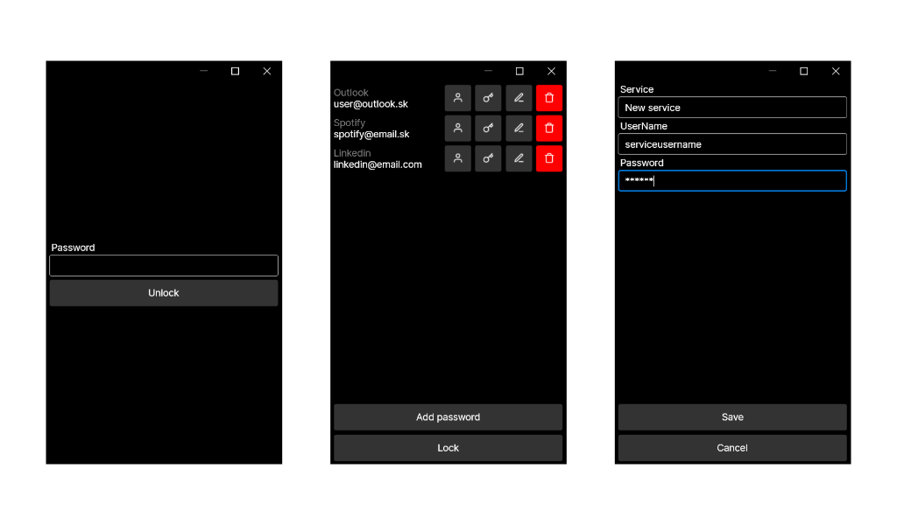

# OnePass offline encrypted password manager

Store your passwords in an encrypted offline database.

Open the app with your password and acces all your stored password.

## Features
- Crossplatform thanks to [Avalonia](https://avaloniaui.net/)
- Encrypted database thanks to [LiteDB](https://www.litedb.org/)
- Manage all your passwords in one app
- Copy to clipboard your username/password
- Automatic app lock after 1 minute of inactivity

## Screenshots
